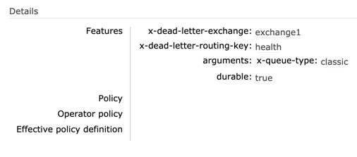

# Scheduling Messages in RabbitMq using Spring AMQP

### RabbitMq Setup
* [Install the RabbitMq](https://www.rabbitmq.com/download.html)
* Create an exchange say **exchange1** & bind it to a queue, from which the messages will be consumed
* Create another exchange say **delayed.dx** to post scheduled messages
* Create a queue say **delayedq** with argument **x-dead-letter-exchange** & **x-dead-letter-routing-key** to receive the scheduled messages <br />
   eg:
  
* Bind the **delayedq** to **delayed.dx** with **routingKey**


### To run this code
* Clone this poc-repo and import schedule-message project into IDE
* Make the required changes in application.yaml
* Run ScheduleApplication.java

### To post scheduled message to rabbitmq
```
curl --location --request POST 'localhost:8080/schedule' 
--header 'Content-Type: application/json' 
--data-raw '{
"message":"hello world!",
"ttl":30000
}'
```